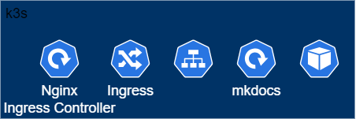

# This website is hosted on my raspberry pi :sunglasses:

This website is developed for showcasing my information, managing my projects, hosting and sharing my blog posts, and etc.

## Related Skills

:simple-kubernetes:  Kubernetes , &nbsp;
:simple-k3s:         k3s , &nbsp;
:simple-docker:      Docker , &nbsp;
:simple-python:      Python , &nbsp;
:simple-github:      GitHub , &nbsp;
:simple-linux:       Linux , &nbsp;  
:simple-raspberrypi: Raspberry Pi

## Architecture

