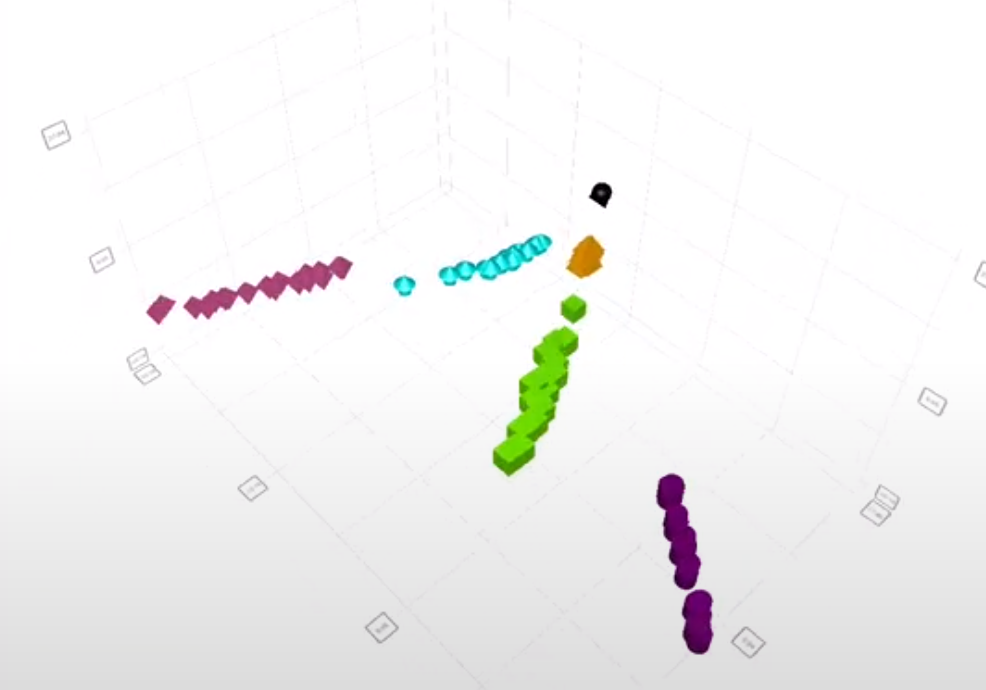

# Real-time Q3DScatter embedded in QWidget-based application

I am writing this article because I could not find any article talking specifically about this topic. 

<!-- more -->

When you want to use Qt Quick content inside of QWidget-based application, you usually bump into two options; QQuickView and QQuickWidget.
Here is a quick summary for both options:

- QQuickView
- QQuickWidget

