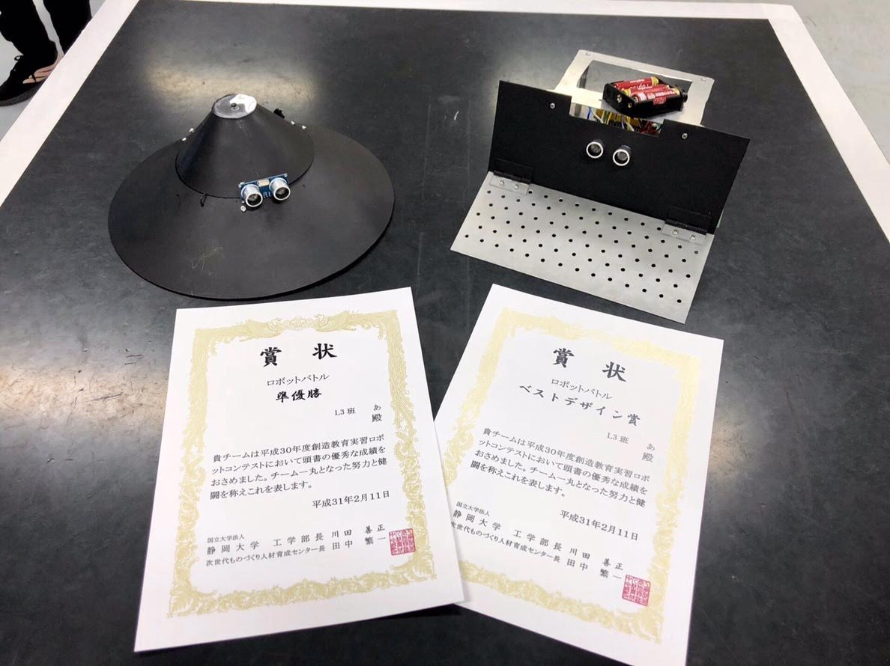

<!-- The stylesheet is set at the bottom of this file -->

---

{:target="_blank" .project-thumbnail }

### **Extended MyoSuite Demo** [:material-web:](https://ttktjmt.github.io/myoweb){:target="_blank" rel="noopener noreferrer" title="GitHub Pages" style="float: right; margin-right: 1rem;"} [:simple-github:](https://github.com/ttktjmt/myoweb){:target="_blank" rel="noopener noreferrer" title="Source Code" style="float: right; margin-right: 1rem;"}

[myosuite_demo](https://github.com/MyoHub/myosuite_demo){:target="_blank"} is a browser-based collection of musculoskeletal models powered by [mujoco_wasm](https://github.com/zalo/mujoco_wasm){:target="_blank"} and [Three.js](https://threejs.org){:target="_blank"}. As an extension to this demo, I integrated an additional MuJoCo model that was featured in the MyoChallenge 2024 competition. I also implemented pseudo control options for reinforcement learning control and enabled model simulation without requiring a corresponding policy, showcasing new visualization features planned for future contributions to the MyoSuite.

???+ skills

    [{:style="width: 1em;"} MyoSuite](https://github.com/MyoHub/myosuite){:target="_blank"} ,
    :material-shape: MuJoCo ,
    :simple-threedotjs: Three.js ,
    :simple-webassembly: WebAssembly ,
    :simple-javascript: JavaScript ,
    :simple-python: Python ,
    :simple-github: GitHub ,

---

{: .project-thumbnail }

### **MyoChallenge 2024** [:material-web:](https://sites.google.com/view/myosuite/myochallenge/myochallenge-2024){:target="_blank" rel="noopener noreferrer" title="Official Website" style="float: right; margin-right: 1rem;"} [:material-file-document:](blog/posts/myochallenge2024/comprehensive-guide.md){:rel="noopener noreferrer" title="My Blog" style="float: right; margin-right: 1rem;"} [:simple-github:](https://github.com/ttktjmt/myochallenge-neuroflex){:target="_blank" rel="noopener noreferrer" title="Source Code" style="float: right; margin-right: 1rem;"}

As a member of the [MyoSuite](https://sites.google.com/view/myosuite){:target="_blank"} community and the [MyoChallenge Advocacy Team](https://sites.google.com/view/myochallenge-2024-advocacy/advocacy-team){:target="_blank"}, I created a [blog](blog/posts/myochallenge2024/comprehensive-guide.md) explaining the general process of participating in the [MyoChallenge 2024](https://sites.google.com/view/myosuite/myochallenge/myochallenge-2024){:target="_blank"} competition. The blog was cited on the [official website](https://sites.google.com/view/myochallenge-2024-advocacy){:target="_blank"} and featured by the official account on SNS ([Linkedin](https://www.linkedin.com/posts/vittorio-caggiano-26b6a7b_myochallenge-neurips-myosuite-activity-7238908256369205248-IiFi){:target="_blank"}, [X](https://twitter.com/MyoSuite/status/1833159649840783719){:target="_blank"}) 
Formed a team *neuroflex* with international enthusiasts and won **3rd place** in the Bimanual Task and the [DEI Team Award](https://github.com/ttktjmt/myochallenge-neuroflex?tab=readme-ov-file#myochallenge-2024---team-neuroflex "Award for the team with diverse and inclusive backgrounds"){:target="_blank"}.

???+ skills

    [{:style="width: 1em;"} MyoSuite](https://github.com/MyoHub/myosuite){:target="_blank"} ,
    :simple-openaigym: Gym ,
    :material-shape: MuJoCo ,
    :simple-pytorch: PyTorch ,
    :simple-docker: Docker ,
    :simple-python: Python ,
    :simple-github: GitHub ,
    :material-robot: Reinforcement Learning

---

{: .project-thumbnail }
{: .project-thumbnail }

### **Portfolio Website (this site)** [:simple-github:](https://github.com/ttktjmt/ttktjmt.com){:target="_blank" rel="noopener noreferrer" title="Source Code" style="float: right; margin-right: 1rem;"}

Check out the [**About tab**](about/overview.md) for detailed information.

???+ skills

    :simple-materialformkdocs: Material for Mkdocs ,
    :simple-kubernetes: Kubernetes ,
    :simple-k3s: k3s ,
    :simple-docker: Docker ,
    :simple-python: Python ,
    :simple-html5: HTML ,
    :simple-css3: CSS ,
    :simple-javascript: JavaScript ,
    :simple-github: GitHub ,
    :simple-githubactions: GitHub Actions ,
    :simple-cloudflare: Cloudflare ,
    :simple-raspberrypi: Raspberry Pi

---

{: .project-thumbnail }

### **Galton Board Simulator** [:simple-github:](https://github.com/ttktjmt/galtonboard-qt){:target="_blank" rel="noopener noreferrer" title="Source Code" style="float: right; margin-right: 1rem;"}

The [Galton Board](https://en.wikipedia.org/wiki/Galton_board){:target="_blank"}, also known as the Galton box, quincunx or bean machine, is a device that visually demonstrates the [central limit theorem](https://en.wikipedia.org/wiki/Central_limit_theorem){:target="_blank"} by dropping balls through a pegged board, resulting in a normal distribution. 
I developed a 2D simulator as an Android app using [box2d](https://github.com/erincatto/box2d){:target="_blank"} as a physics engine. It uses the accelerometer sensor in the device (phone, laptop) to change the gravity in the simulation, resulting in a different distribution.

???+ skills

    :simple-cplusplus: C++ ,
    :simple-qt: Qt ,
    :material-shape: Box2D (Physics Engine) ,
    :simple-github: GitHub

<!-- 
---

### **Company Website** [:material-web:](https://mu-borg.com){:target="_blank" rel="noopener noreferrer" title="Home Page" style="float: right; margin-right: 1rem;"}

I developed and published a website for the company that was launched from the university laboratory I was affiliated with, using Notion and Cloudflare. I also carried out tasks such as registering domain names and creating email addresses for them.

???+ skills

    :simple-notion: Notion ,
    :simple-cloudflare: Cloudflare

 -->

<!-- 
---
### **Sleep Quality Measurement App** <a href="" :target="_blank" rel="noopener noreferrer" title="More Resources" style="float: right; margin-right: 1rem;"> :simple-googledrive: </a>

explanation

???+ skills

    :material-math-integral-box: MATLAB

 -->

<!-- 
---

{: .project-thumbnail }

### **Silicone Finger Manufacturing** [:simple-youtube:](https://youtu.be/nTcUPr6ovEE){:target="_blank" rel="noopener noreferrer" title="Silicone Finger Video" style="float: right; margin-right: 1rem;"}

I contributed to another student's research project, focusing on the development of a servo motor-operated silicone finger.

???+ skills

    :material-robot: Robotics ,
    :material-chip: Electronics ,

 -->

---

{: .project-thumbnail }

### **Overall Manufacturing Process of Myoelectric Prosthetic Hand** [:simple-youtube:](https://youtu.be/nTcUPr6ovEE){:target="_blank" rel="noopener noreferrer" title="Silicone Finger Video" style="float: right; margin-right: 1rem;"}

Prior to joining the lab, I had the opportunity to engage in the overall process of creating a myoelectric prosthetic hand. The process I experienced involved the following key components:

- Manufacturing a Conductive Silicone sEMG Sensor and a Sensor Band to wrap them around the forearm
- Building an embedded system, which included:
    - Assembling the hardware components
    - Writing the firmware (Signal Processing, Feature Extraction, Neural Network, Bluetooth Communication, etc) in C
- Constructing the mechanical hand itself
- Developing a tablet application in C++ to interface with the prosthetic hand
- Silicone Finger Manufacturing (as part of another student's research)

???+ skills

    :simple-c: C (programming language) ,
    :simple-cplusplus: C++ ,
    :simple-qt: Qt 

---

{: .project-thumbnail }

### **Voice Controlled Robot Hand** [:simple-youtube:](https://youtu.be/zjVYmhg9dLg){:target="_blank" rel="noopener noreferrer" title="Video" style="float: right; margin-right: 1rem;"}

I built my own robot hand from cardboard, servo motors, string, etc., connected it to a Raspberry Pi and a USB microphone, and used voice recognition to control it with my voice. 
The idea behind this project was to enable anyone to operate a high DOF prosthetic hand without training, as I felt that operating a prosthetic hand with electrical signals from muscles is intuitive but difficult to achieve high DOF.

???+ skills

    :simple-python: Python ,
    :simple-raspberrypi: Raspberry Pi

---

{: .project-thumbnail }

<!-- <iframe width="330rem" height="315rem" src="https://www.youtube.com/embed/zjVYmhg9dLg" frameborder="0" allow="accelerometer; autoplay; clipboard-write; encrypted-media; gyroscope; picture-in-picture" allowfullscreen style="float: left; margin-right: 20px; margin-bottom: 20px;"></iframe> -->

### **TETRIS on Arduino Game Console** [:simple-youtube:](https://youtu.be/Kmq4INAJUeA){:target="_blank" rel="noopener noreferrer" title="Video" style="float: right; margin-right: 1rem;"} [:simple-googledrive:](https://drive.google.com/drive/folders/1XIpsRjvyxm8ZJICFTqMlnAM3WdH2CrXw?usp=drive_link){:target="_blank" rel="noopener noreferrer" title="More Resources" style="float: right; margin-right: 1rem;"}

I created a classic game console using an [Arduino Nano](https://store.arduino.cc/products/arduino-nano){:target="_blank"} and a lot of LEDs. To extend the controllable pin capacity of the Arduino Nano, I used shift registers ([SN74HC595](https://www.ti.com/product/SN74HC595){:target="_blank"}). I soldered 136 LEDs by hand onto a universal board (I know, it's a menace...), allowing independent control of each LED via the Arduino Nano. Using matrix processing, I developed TETRIS in the Arduino language, carefully implementing boundary conditions and block collision avoidance to ensure that the game runs smoothly and is less prone to bugs.

???+ skills

    :simple-arduino: Arduino ,
    :material-soldering-iron: Soldering ,
    :material-gamepad-variant: Game Dev

---

{: .project-thumbnail }

### **Robot Battle Competition**
<!-- ### **Robot Battle Competition** [:simple-youtube:](){:target="_blank" rel="noopener noreferrer" title="Robot Battle Video" style="float: right; margin-right: 1rem;"} -->

As part of a class project, our team developed two robots for the Robot Battle Competition. We had to adhere to strict criteria, (e.g., weight, size, cost limitations), to develop our robots that can remain on stage for a longer period of time than competitors. As a result of our efforts, we won 2nd place in the competition and also received the Best Design Award.

???+ skills

    :simple-arduino: Arduino ,
    :material-soldering-iron: Soldering ,
    :material-chart-line: Signal Processing ,
    :material-robot: Robotics ,
    :material-transit-connection-variant: Electronics

---

  

<!-- TODO: change how I deal with the empty areas -->

